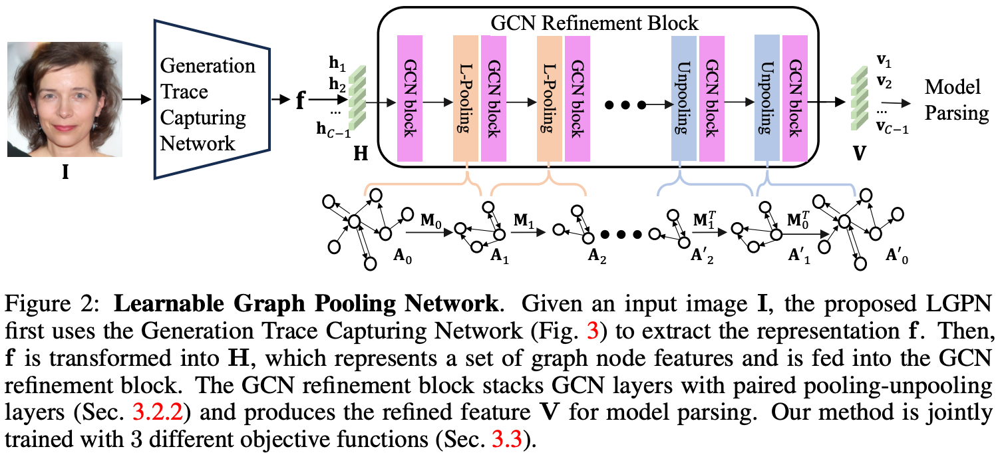

# Tracing Hyperparameter Dependencies for Model Parsing via Learnable Graph Pooling Network

Model Parsing defines the task of predicting hyperparameters of the generative model (GM), given a GM-generated image as the input. Since a diverse set of hyperparameters is jointly employed by the generative model, and dependencies often exist among them, it is crucial to learn these hyperparameter dependencies for improving the model parsing performance. To explore such important dependencies, we propose a novel model parsing method called Learnable Graph Pooling Network (LGPN), in which we formulate model parsing as a graph node classification problem, using graph nodes and edges to represent hyperparameters and their dependencies, respectively. Furthermore, LGPN incorporates a learnable pooling-unpooling mechanism tailored to model parsing, which adaptively learns hyperparameter dependencies of GMs used to generate the input image. Also, we introduce a Generation Trace Capturing Network (GTC) that can efficiently identify generation traces of input images, enhancing the understanding of generated images’ provenances. Empirically, we achieve state-of-the-art performance in model parsing and its extended applications, showing the superiority of the proposed LGPN.

<div style="text-align: center;">
    
</div>

## Preparation

#### Set up a new environment
```
conda create -f environment.yml
```
#### Please download the dataset and related files via [GoogleDrive](https://drive.google.com/drive/folders/189Af7GhydFUDwQvrnyNbuD3CaJCChz78?usp=sharing)


## Pipeline

### Train model
```bash
source ~/.bashrc
conda activate RED
CUDA_NUM=5
CUDA_VISIBLE_DEVICES=$CUDA_NUM python main.py --cross_val=1 --batch_size=256 --lr=0.1
CUDA_VISIBLE_DEVICES=$CUDA_NUM python main.py --cross_val=2 --batch_size=256 --lr=0.1
CUDA_VISIBLE_DEVICES=$CUDA_NUM python main.py --cross_val=3 --batch_size=256 --lr=0.1
CUDA_VISIBLE_DEVICES=$CUDA_NUM python main.py --cross_val=4 --batch_size=256 --lr=0.1
```

### Infernece
```bash
source ~/.bashrc
conda activate RED
CUDA_NUM=5
CUDA_VISIBLE_DEVICES=$CUDA_NUM python inference.py --cross_val=1 --batch_size=256 
CUDA_VISIBLE_DEVICES=$CUDA_NUM python inference.py --cross_val=2 --batch_size=256
CUDA_VISIBLE_DEVICES=$CUDA_NUM python inference.py --cross_val=3 --batch_size=256
CUDA_VISIBLE_DEVICES=$CUDA_NUM python inference.py --cross_val=4 --batch_size=256
```

### Optional arguments in main.py
```
--cross_val     Cross validation set. (1, 2, 3, 4)
--batch_size    Batch size.
--lr            Learning rate.
--model_folder  The folder that saves trained weights. 
--debug         The debug mode flag.
```

## Citation
```
@inproceedings{ tracing-hyperparameter-dependencies-for-model-parsing-via-learnable-graph-pooling-network,
  author = { Xiao Guo and Vishal Asnani and Sijia Liu and Xiaoming Liu },
  title = { Tracing Hyperparameter Dependencies for Model Parsing via Learnable Graph Pooling Network },
  booktitle = { Proceeding of Thirty-eighth Conference on Neural Information Processing Systems },
  address = { Vancouver, Canada },
  month = { December },
  year = { 2024 },
}
```
